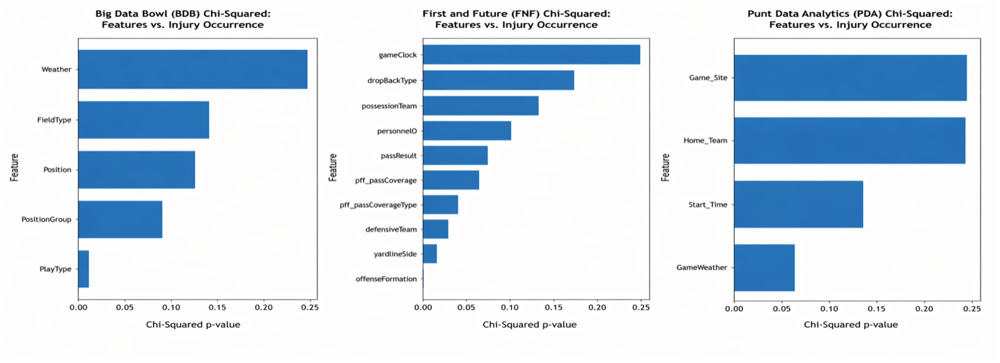
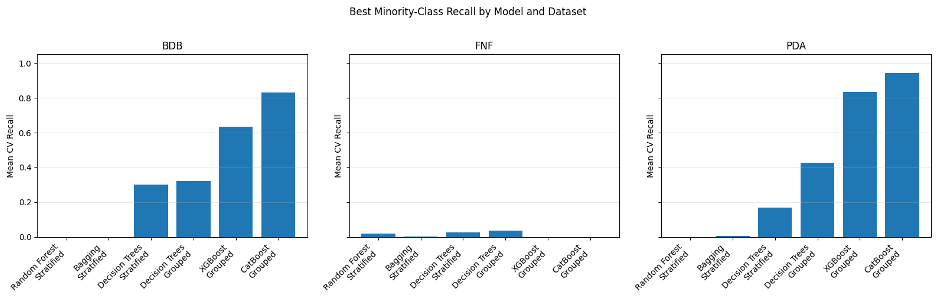
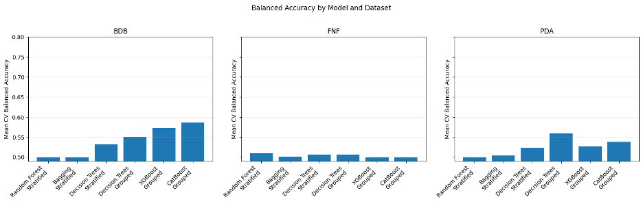

# **Rare Event Multiscal Injury Prediction**
## **Business Report**
- Lee McFarling

---

# **Executive Summary**

The primary goal of this project was to identify whether field level conditions are a contributing factor to injuries in the National Football League. These field factors can be interpreted as conditions such as weather, temperature, turf type, or even play mechanics such as offensive and defensive formations. The exercise is to identify easy changes that the league could make to cut down on injuries which have recently cost the NFL between 500 million and 1.1 billion dollars annually (Evans, 2025). In order to make these determinations, three datasets from the NFL’s databases were analyzed. From there, a plethora of both classical statistical techniques and modern data science practices were applied to the datasets to discern which factors could lead to injury. Classical statistical analysis found that there are a number of field conditions and play mechanics across all three datasets that are closely correlated with injury occurrence. 

However, even the most powerful data science techniques were not able to use this information to reliably predict whether a given play could result in injury (at least not without a high degree of false positives where a model will falsely flag a non-injury play as leading to injury). These findings suggest that combinations of field conditions and play mechanics cannot be used to predict whether an injury will occur on a given play by themselves. Instead, footage from each of these plays should be analyzed and player-to-player interactions like speed, acceleration, and angle of impact should be combined with this data in future analysis. This can then be used to determine whether field factors like play formations, weather effects, and turf conditions influence injury rates through subtle changes in player-to-player ineractions at the moment of impact. This future analysis could then be used for rule changes, stadium renovations, and other simple factors that the league could make to cut down on injuries in the future, and fix a problem that is costing the league huge amounts of money every year. 

# **Introduction & Problem Definition**

American Football continues to be a cultural phenomenon in the United States and break records for viewership every year (Willman, 2024). On top of this continued popularity in North America, there are concerted efforts to expand the sport into other markets as well (NFL, 2025). Despite this, however, the sport is plagued by an exceedingly high rate of injuries compared to other sports. For example, a recent study found that up to 91% of former NFL players suffered from symptoms of chronic traumatic encephalopathy (McKee, 2023). That’s in addition to the aforementioned hundreds of millions of dollars that injuries cost the league every year in salary payouts to benched players. As the human and financial toll continues to rise, the league would stand to benefit from any measure (be that rule change, stadium renovation, turf replacement, etc.) that can meaningfully decrease injury occurrence. 
    
In this sense, we will use statistical techniques to find which field conditions are closely associated with injury occurrence. From there we will use data science models to use these factors to predict injury occurrence from field factors on any given play. Because injuries are rare events (happening 2.5% of the time or less), whether a data science technique can pick up on plays that lead to injury will be the primary metric we track. Because increasing this sensitivity of data models can cause them to throw false flags on plays, we will also use a balanced accuracy approach which will track both the number of correctly identified injury plays and the number of false positives as well (which we will average into a balanced accuracy score). In this sense, we will determine success as the accurate signaling of > 80% of injury plays without our balanced accuracy metric falling below 65%. If both statistical methods and data science techniques are successful, then we can deem a field condition as being meaningful to injury rates, and inform the league of simple changes it can make to mitigate this problem. 

# **Data Overview:**

For this project, three datasets were used. All three datasets were obtained from the NFL’s own databases and pre-filtered for Kaggle competitions over the past 10 years, but here we will re-purpose them for our injury prediction task. For identification purposes, we will refer to each of the datasets by their Kaggle competition name (i.e. Big Data Bowl (BDB), First and Future (FNF), and Punt Data Analytics (PDA) datasets). A summary of these datasets is presented in Table 1. Each dataset contains a different mix of information that could be useful in determining injury prediction (as each dataset was compiled and pre-filtered for different purposes). These ‘field factors’ are what we will investigate to see if they lead to injuries. Though by no means a comprehensive list, Figure 1 represents the top field factors in each dataset that will be investigated in this analysis. 

## Dataset Summary

| Dataset | Records | Injuries | Data Types | Columns |
|---------|---------:|---------:|------------|---------:|
| Big Data Bowl | 8,557 | 209 (2.44%) | 58% Categorical, 36% Numeric, 6% Boolean | 25 |
| First and Future | 267,006 | 77 (0.03%) | 55% Categorical, 41% Numeric, 4% Boolean | 22 |
| Punt Data Analytics | 6,681 | 91 (1.36%) | 72% Categorical, 24% Numeric, 4% Boolean | 25 |

**Table 1.** Summary Statistics of the three NFL datasets. Note: Because numeric data was not highly correlated to the Injury Prevalence, summary statistics of those features specifically are omitted.

Overall, this analysis will investigate not only if factors like ‘weather’ or ‘field type’ could lead to injuries, but whether specific combinations of these events have any effect on injury rates.

| Feature | Dataset | Type | Description |
|---------|---------|------|-------------|
| Weather | FNF, PDA | Categorical | Weather conditions on the field |
| Temperature | FNF | Numeric | Temperature (°F) |
| Field Type | FNF, PDA | Categorical | Turf or grass surface |
| Stadium Type | FNF, PDA | Categorical | Indoor, outdoor, domed |
| Home Team | PDA, BDB | Categorical | Home team |
| Visit Team | PDA, BDB | Categorical | Away team |
| Offensive Formation | BDB | Categorical | Offensive formation |
| Defensive Formation | BDB | Categorical | Defensive formation |
| Yard Line Side | BDB | Categorical | Home/Away side of field |
| Drop Back Type | BDB | Categorical | QB dropback type |
| Position Group | BDB, FNF | Categorical | Player position |
| Pass Coverage Type | BDB | Categorical | Defensive coverage |
| Pass Result | BDB | Categorical | Pass outcome |
| Game Start | FNF, PDA | Categorical | Game start time |
| Foul on Play | BDB | Boolean | Penalty indicator |
| Inj_Occurred | All | Boolean | Injury occurrence (target variable) |

**Figure 1.** Dictionary of variables most relevant to analysis across all three datasets. The table contains information for Feature (column), which datasets that feature appeared in, the data type, and a brief description of the field in question.

# **Data Cleaning, Preprocessing, and Exploratory Data Analysis (EDA)**

Regarding the data cleaning and pre-processing of each dataset, missing values and inconsistencies were handled according to best practices in data science. As these values came from the NFL’s own databases, there was a very minimal amount of cleaning and processing that had to take place. 

After that process, a statistical analysis was run on each of the field level factors that were identified earlier as they relate to injury rates. It was found that field factors like player positioning, velocity and acceleration were not usable without reviewing footage to find the moment of injury. To quickly explain, the datasets often included values like velocity, acceleration, and positioning for every player, for every microsecond, of every play, of every game, of every year of analysis without designating which player was injured at which moment. So for the sake of this project, focus was placed on field level factors that did have genuine, statistical significance to injury rates. Because this project was looking at combinations of many different features, we kept the ones that were moderately correlated with injury rates as well because these could interact with other features to cause injury rates (i.e. maybe a pass coverage type is dangerous when in snowy weather, etc.) 

# **Modeling / Analysis**

Once a list of field factors that were statistically associated with injury rates was obtained, the data science began. Because categorical variables like pass coverage type and defensive formation were statistically associated with injury rates instead of continuous numeric values like positioning (i.e. what yard line is someone at on the field when they get injured). The decision was made to go with tree-based models as a family of data science methods to evaluate how combinations of field factors like weather and team information stack. For reference, this family of data science models offer a 20-questions-like approach where they can stack multiple questions (or ‘splits’ as we call them)  like ‘was it raining?’, with ‘what stadium were the teams playing in?’ with ‘what offensive formation did the attacking team run with?’, to ‘what pass coverage did the defensive team respond with?’ to predict whether an injury occurred. This is especially helpful to our research question because we are trying to figure out which of these factors stack together to influence injury rates, with the specific goal of the league interrupting these chains to prevent these events. For example, if three pass coverage types are very dangerous in the rain (but they’re not in indoor stadiums) they can potentially save themselves tens of millions annually in sidelined player salaries by planning their next stadium renovation to be indoors. 
    
In this sense, we implemented five of these ‘tree based’ models at varying levels of complexity, using different methods (like grouped approaches where we train the models on one group of games and then have them guess whether injuries occurred in new games based on the metrics they’ve learned), and other methods to extract as much information as possible out of an inherently rare event.

# **Results:**

Going into the analysis, we knew that although injuries occurred multiple times throughout a season, on any given play they are a rare event (ranging from 2.5/100 for the Big Data Bowl dataset, to ~3/10,000 for the First and Future dataset). Because of this rarity, we had two simple goals for our models: Correctly identify at least 80% of our injury plays, and don’t get too many false positives (i.e. don’t make our ‘balanced accuracy’ average of true positives and false positives discussed earlier fall below 65%). In this, we only had marginal results. Even though a lot of the models achieved very high ‘accuracy’ scores overall, they achieved this because they essentially learned to predict ‘no injury’ every time. While this might artificially make a model look very strong on paper, it is not useful to us. 
    
In order to ameliorate this, we embarked on a regime to find a modeling strategy that would correctly identify injury-causing plays as they occur. Eventually, we were able to get models that correctly identified injury plays over the threshold that we wanted, but we were not able to achieve this while minimizing the number of false flags to the degree that we wanted. Figure 3 shows the different strategies we tried and their relative success within the different datasets of correctly identifying plays that led to injury. In the figure, this is referred to as ‘minority recall’ but can be interpreted as ‘injury detection rates’.  For example, a ‘0.8’ in this chart can be interpreted as saying ‘the model was able to accurately identify 80% of injury plays. 

However, as we talked about earlier, picking up on plays that lead to injury is only half of the story. We also need the model to correctly ignore non-injury plays, which is why our balanced accuracy metric was used as well. In this sense, if a model correctly identifies 80% of injuries but only scores a .50 in our ‘balanced accuracy’ metric, then the model is also generating so many false positives that it is no better than randomly guessing. Going into this project, we set a goalpost of our models being able to achieve at least a 65% on this metric, and most of the models fell well short of this mark. Our XGBoost and CatBoost models were able to perform the best (on the Big Data Bowl dataset specifically) but they were only able to achieve ~58-60% in balanced accuracy metrics as shown in Figure 4. 

In general, the rarer the injury event within a dataset, the lower the predictive performance was on the models across the board. The signal that we were able to pick up from the Big Data Bowl dataset was the strongest (with an injury rate of 2.5%). A weaker signal was picked up from the Punt Data Analytics dataset (which was pre-filtered to only include head injuries, and therefore only had a 1.38% injury rate). And the predictive signal from the First and Future dataset basically collapsed (this dataset was the most aggressively filtered of the three, only including lower extremity injuries, and had an injury rate of 0.02%). 

That being said, the models did confirm that certain features had more of an effect on injury rates, but this should be interpreted with caution at this time because of the aforementioned lack of ‘balanced accuracy’ performance. As another preliminary measure the following field level features were important in injury mechanics: Scoring metrics; Week number within a season; Certain game locations; the number of yards players ran on a given play; proximity to the end of a quarter when a play is initiated; and the number of defenders in the box when the ball is snapped. 

# **Recommendations:**

Again, these field conditions should only be taken as a preliminary signal until further analysis is conducted. Even though this project was able to find plays and field factors that were statistically related to injury rates, we were not able to use this information to build models that could predict these injuries in a stable way. For this reason, further analysis is needed before we can conclude that these macro level features are related to injury rates with any confidence. Instead, the fact that these field conditions are statistically associated with injury occurrence but not able to predict injury rates by themselves suggests that these are confounders. i.e. they have an indirect effect on injury rates by subtly effecting velocity and acceleration of players on the field right before the moment of injury. For example, snowy weather and player fatigue might affect a running back’s ability to change direction on the fly, which could become riskier if multiple defenders are in the box. 

Therefore, it is not recommended that the league pursue any rule changes, practice schedule changes, or stadium renovations based on this analysis alone. Even though certain locations and player fatigue analogs are preliminarily associated with injury rates, they cannot predict them alone. Instead, our recommendation is that we go back and analyze game footage to be able to lift out player-to-player interactions at the moment of injury. This biomechanical data could then provide the missing piece towards restoring the modeling techniques’ ability to predict injury rates with a meaningful level of accuracy. 

Despite the difficulty of extracting this information, we strongly encourage further analysis. The cost of doing so is modest compared to the substantial financial burden to the league every year. Even a small reduction in preventable in salary costs to benched players, improve player availability, reduce reputational risk, and strengthen the sport by mitigating any negative effects on player health. For these reasons, continued investment in biomechanical injury analysis is one of the highest-return investments the league could make at this time. 

# **References:**

Campione, K. (2024, February 9). Most-watched TV shows of all time. Deadline. https://deadline.com/gallery/most-watched-tv-shows-all-time/

Evans, D. (2025, March 3). Which NFL team had the highest injury cost in the 24/25 season? Sportscasting. https://www.sportscasting.com/news/which-nfl-team-had-the-highest-
injury-cost-in-the-24-25-season/

McKee, A. (2023, February 6). Researchers find CTE in 345 of 376 former NFL players studied.
Boston University Chobanian & Avedisian School of Medicine.https://www.bumc.bu.edu/camed/2023/02/06/researchers-find-cte-in-345-of-376-former-
nfl-players-studied/12

NFL. (2025, March 31). NFL’s Global Markets Program adds four new clubs, two new markets	
in 2025. https://www.nfl.com/news/nfl-global-markets-program-four-new-clubs-two-
new-markets-2025
