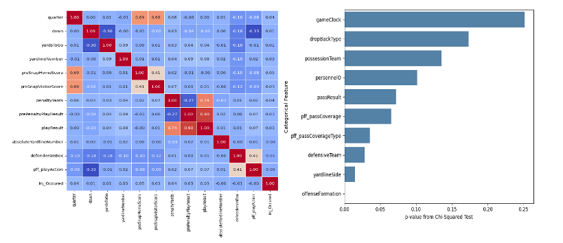
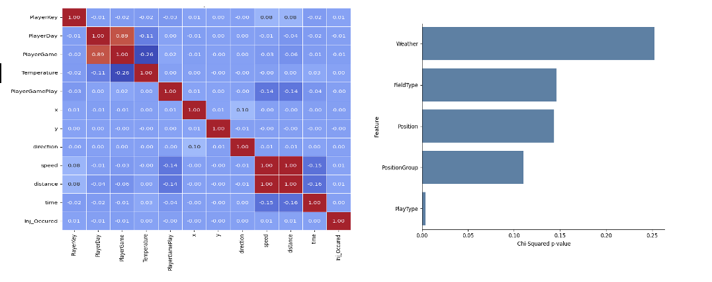
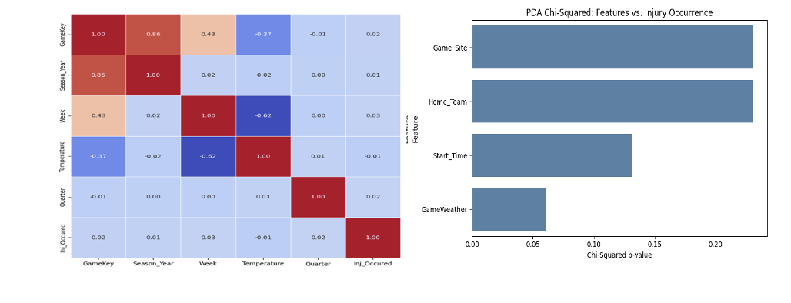
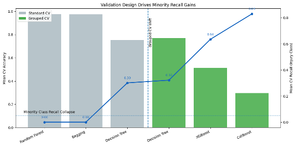
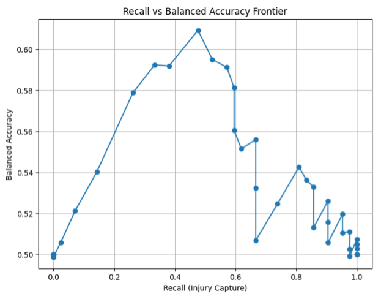
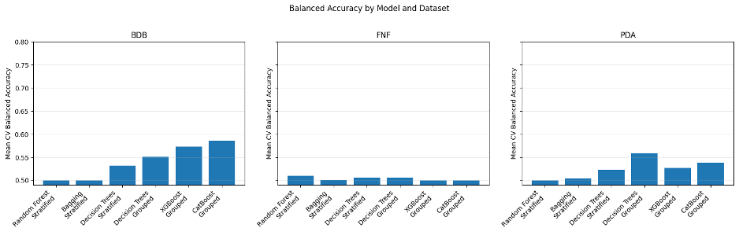
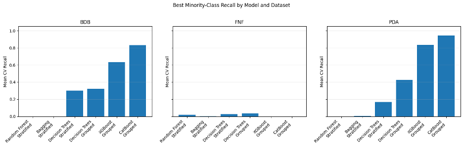
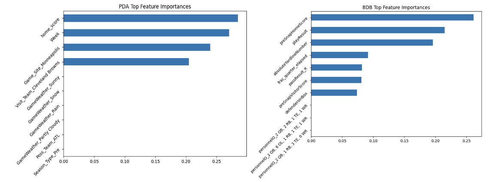

# **Rare Event Multiscal Injury Prediction**
## **Technical Report**
- Lee McFarling

---

# **Executive Summary**

The primary goal of the project is to identify specific macro / field level statistics that lead to injury occurrence in the National Football League. These macro statistics refer to conditions that are present on the field at the time of a play, such as weather, field type, or offensive and defensive formations. This exercise is to identify easy changes that the league could make to cut down on injury prevalence which has recently cost the league between $500 million and $1.1 billion annually (Evans, 2025). In order to determine which conditions have the greatest impact on injury prevalence, three datasets from the NFL’s databases were analyzed. From there, 5 different machine learning models were selected and optimized for performance on features that could lead to injury. However, even the most powerful models failed to reliably predict injuries from macro field factors, despite the statistical associations between these factors and injury prevalence observed in exploratory analysis. This indicates that injury occurrence is primarily caused by direct player-to-player interactions at the moment of impact (speed, acceleration, etc.), and that macro field conditions are confounders that influence these biomechanical factors indirectly. Based on these findings, extensive renovations undertaken by the league for the sake of injury prevention (i.e. turf conversion to grass, outdoor to indoor field conversion) are not recommended based on the evidence from this analysis. Instead, a review of video footage is necessary to extract biomechanical data from plays at the moment of injury. From there, further analysis can determine if a complex interaction of macro field factors could mediate injuries through subtle changes in player speed and orientation at the point of impact. This could then be used to inform rule changes, stadium renovations, and other simple changes that the league could make to cut down on injuries in the future. 

# **Introduction & Problem Definition**

## Background

On February 9, 2025, Super Bowl LIX officially became the most watched television broadcast in the history of the United States, with 128.7 million viewers (NFL.com). While this may appear impressive for a sports broadcast, it is actually the norm. At the time of writing this, 9 of the top 10 television broadcast records in U.S. history are Super Bowl games (Willman, 2024). And on top of this continued popularity of American Football in the United States, there are concerted efforts to expand the sport into other markets in the United Kingdom, the European Union, and the Arab Gulf (NFL, 2025).  Despite this success, however, the sport is plagued by an exceedingly high rate of injuries compared to other sports. One recent study from Boston University found that over 91% of former professional football players had symptoms of chronic traumatic encephalopathy (such as severe mood changes, cognitive decline, and dementia) (McKee, 2023). The short-term effects of injuries are equally severe. A study in 2010 found that 34.5% of players placed on the injury reserve list never returned to play in the NFL during any of the next four seasons (Markowitz, 2016). Even if an injury is not career-ending, players often require months of recovery, causing their teams to lose vital talent coverage.  Financially, the league incurs significant financial losses as well, with the league losing over 530 million dollars in paying salaries to players sidelined due to injuries in 2024 alone (Evans, 2025). 

## Objectives

With this notable financial and human cost to the league and its players every year, there is a significant upside in any reasonable measure that can reduce injury prevalence. Additionally, while prior analyses have focused on player biomechanical data (speed, angle of impact, etc.), it is much more actionable for the league to make rule changes to effect field conditions writ large, than to attempt to police a player’s biomechanics directly. Therefore, the question of whether macro field-level conditions (e.g. weather, turf type, formations) are associated with injury occurrence is especially helpful. If these associations exist, they could point to simple rule or field changes, field level changes, or tactical changes that the league could implement to cut down on the substantial human and financial cost of these injuries while preserving the continued success of the sport.
    
However, there is a problem with this in that injury-related plays represent an extreme minority of plays overall. In the datasets presented injury occurrence rates range from 0.02% for one dataset looking at lower extremity injuries, to 2.4% in one dataset looking at concussions specifically. This extreme class imbalance will represent a significant challenge for any modeling exercise trying to reliably predict injury prevalence. From a data science perspective, this analysis on injury occurrence therefore becomes a rare-event binary classification problem using contextual (play-level) features. 

To investigate this, three datasets were taken from NFL databases, covering approximately ten years of play data and field conditions. From there, an extensive exploratory data analysis was conducted, followed by the training and evaluation of multiple binary classification models to determine which factors were most strongly associated with injury prevalence. 

## Success Criteria

Because the extreme class imbalance paired with the multifactorial nature of injuries (impact dynamics, field conditions, weather conditions, fatigue, etc.). Success criteria for this analysis must be ambitious enough to provide real signal for the league, while also being realistic about the problem itself (achieving above 95% in class recall on a task like this without significantly producing false positives is unlikely). Taking this into consideration, we will value the number of true positives (in class recall for injury cases) the most. As such we will be targeting an in-class recall above 80%, as any in class recall below that figure is unlikely to provide any substantive information for the league. Likewise, (and somewhat counterintuitively) because the purpose of this analysis is to surface risky conditions for injuries, not necessarily make an on-the-spot injury prediction machine for the NFL, a moderate amount (in absolute terms) of False Positives (~200 out of 267,000 plays) is tolerable, so long as the balanced accuracy does not dip below 65%. 

In this sense, we will measure success in this analysis as an in-class recall above 80% percent with a balanced accuracy above 65%. This will give us sufficient evidence to surface field conditions on those plays as risky and in need of further analysis to the league. If our efforts fail in this regard, however, we will be forced to conclude that macro field level conditions do not have enough of a predictive signal to influence injury outcomes in the datasets given, and further analysis / research directions will be recommended. 

# **Data Overview**

## Data Source Description and Collection Methods

All three datasets used in this analysis were collected by the National Football League over a period of ten years, pre-filtered and de-identified for Kaggle data analytics competitions that the league held. The first of these was the NFL First and Future dataset which originally consisted of 3 separate CSVs were then merged and compiled, and the resulting dataset consisted of 22 columns and 267,000 samples [Figure 1], focused on lower extremity injuries (feet, ankles, knees, etc.), and included variables like weather, field type, stadium type, surface conditions and NFL Next Gen Statistics (NGS) player movement data. 

## Dataset Summary

| Dataset | Records | Injuries | Data Types | Columns |
|---------|---------:|---------:|------------|---------:|
| Big Data Bowl | 8,557 | 209 (2.44%) | 58% Categorical, 36% Numeric, 6% Boolean | 25 |
| First and Future | 267,006 | 77 (0.03%) | 55% Categorical, 41% Numeric, 4% Boolean | 22 |
| Punt Data Analytics | 6,681 | 91 (1.36%) | 72% Categorical, 24% Numeric, 4% Boolean | 25 |

**Table 1.** Summary Statistics of the three NFL datasets. Note: Because numeric data was not highly correlated to the Injury Prevalence, summary statistics of those features specifically are omitted.

The Big Data Bowl dataset was also considered and consisted of twelve CSV files containing play-by-play information and NGS movement data. After merging and aggregation, the final dataset had 8557 plays, 209 of which resulted in Injury (a 2.44% injury rate) [Figure 1].  Finally, the NFL Punt Data Analytics dataset that was compiled from the 2015 – 2017 seasons by the NFL and filtered to contain information regarding only punt plays (J et al., 2018). The summary statistics of these datasets are articulated below:   

## Dataset Dictionary

Each dataset contained between 20 and 40 variables describing play context, player positioning, and field conditions. Because categorical variables were encoded, the final feature set was north of 100 columns prior to feature selection. For brevity, Figure 2 summarizes the variables most relevant to the analysis across all three datasets, complete with columns for feature name, dataset of origin, data type, and a brief description. A complete list of variables for each dataset is provided in [Appendix C]. 

| Feature | Dataset | Type | Description |
|---------|---------|------|-------------|
| Weather | FNF, PDA | Categorical | Weather conditions on the field |
| Temperature | FNF | Numeric | Temperature (°F) |
| Field Type | FNF, PDA | Categorical | Turf or grass surface |
| Stadium Type | FNF, PDA | Categorical | Indoor, outdoor, domed |
| Home Team | PDA, BDB | Categorical | Home team |
| Visit Team | PDA, BDB | Categorical | Away team |
| Offensive Formation | BDB | Categorical | Offensive formation |
| Defensive Formation | BDB | Categorical | Defensive formation |
| Yard Line Side | BDB | Categorical | Home/Away side of field |
| Drop Back Type | BDB | Categorical | QB dropback type |
| Position Group | BDB, FNF | Categorical | Player position |
| Pass Coverage Type | BDB | Categorical | Defensive coverage |
| Pass Result | BDB | Categorical | Pass outcome |
| Game Start | FNF, PDA | Categorical | Game start time |
| Foul on Play | BDB | Boolean | Penalty indicator |
| Inj_Occurred | All | Boolean | Injury occurrence (target variable) |

**Table 2.** Dictionary of variables most relevant to analysis across all three datasets. The table contains information for Feature (column), which datasets that feature appeared in, the data type, and a brief description of the field in question.

## Dataset Quality Analysis

Regarding data quality, all three datasets had a number of free text fields that needed standardization. For example, Weather was often expressed as values like: ‘Cloudy, chance of rain’ which could be consolidated into ‘Cloudy’. Additionally, the **First and Future** Dataset had some temperature values were recorded as -999°F and needed to be imputed with the median temperature in the dataset. There were high null value counts in ‘Surface’, ‘InjuryLength’, and ‘BodyPart’, though these columns were only filled out for plays that led to injuries, and could be easily handled. The **Big Data Bowl** dataset had four ‘Foul-Id’ that could be consolidated into a Boolean tag, and a negligible number of null fields (< 6% null in two categorical columns) that could easily be handled in EDA. Finally, the **Punt Data Analytics** dataset had two categorical columns column that needed standardization and contained ~ 8.77% null fields in the Temperature column which again would need to be evaluated in EDA. 

Each dataset contained a plethora of Next Generation Statistics (NGS) including statistics like speed, orientation, acceleration, and positional coordinates for each player on the field in decisecond increments. Because the scope of this analysis was on macro field conditions, it was largely considered outside of the scope of this analysis. Additionally, it was impossible to filter this information to specifics relevant to an injury (player A hits player B 3.6 seconds into the play) without individually reviewing footage for every injury and tying this to player ID numbers. Not doing this step would result over 76,000,000 rows of extraneous information to be added to the analysis of each dataset. Therefore, for the sake of this analysis, NGS data was aggregated to give a broader macro statistic than being used in its full granularity. 

## Ethical Considerations

Regarding ethical considerations of the datasets, each of the datasets was selectively de-identified, and pre-filtered by the NFL before it was released to the public (whereby ID numbers are used as proxies for players, etc.), but there is a risk that any analysis here could necessarily re-identify players, based on characteristics like team, and positional information. Great care should be taken to ensure that recommendations do not single out specific players, teams, or coaching strategies as being ‘riskier’. Finally, there is an extreme class imbalance in each of these datasets, so great care should be taken when making recommendations. We are working with an extremely low signal, where false positives could condemn team play styles based on low evidence, and false negatives could lead to a misinterpretation of risk when it comes to athlete health.

# Data Cleaning & Exploratory Data Analysis

For each of the three datasets, data cleaning and exploratory analysis was conducted to address any inconsistencies identified previously. From there a combination of univariate, bivariate, and multivariate analysis were undertaken to identify variables with potential associations to injury occurrence. 

## Data Cleaning / Pre-Processing

For the **First and Future** dataset, there were a number of data cleaning / preprocessing steps that needed to be completed before EDA was conducted. For example, categorical variables contained free text representations in columns like Weather, Field Type, Play Type, and Position Group needed to be standardized. For example, the Weather category had 73 free text representations of the weather on a given day which were aggregated into categories like sun, rain, fog, N/A (indoors), etc. There were also a number of categorical fields like ‘Injury Location’ that were only filled out when an injury occurred. These were imputed with ‘unknown’ when blank.  Finally, there were sentinel values in the Temperature field (-999°F) that were imputed with the median temperature value (only ~0.03% of these corresponded to the target class). Like the First and Future dataset, the **Punt Data Analytics** dataset had to undergo standardization for both the Weather and Game Time Start fields to aggregate free text representations into discernable categories. There was also an exceedingly small number of null values for this dataset, which made imputing either median or ‘unknown’ values for numeric or categorical data separately an easy choice. Finally, while the **Big Data Bowl** needed less standardization due to a lack of free text fields like weather and studium type, as mentioned earlier, there were four ‘foul-id’ fields that lacked predictive power. These were consolidated into a new column, ‘foul_occured’, with more signal. Additionally, while there were high amounts of duplicate values in categorical fields like Defensive Team for example (a single team will be on defense for multiple plays), these corresponded to expected game mechanics rather than data anomalies. 

# **Exploratory Data Analysis / Key Findings:**
    
For each of the three datasets, a univariate, bivariate, and multivariate analysis was conducted in order to elucidate any key findings before both feature engineering and dimensionality reduction. Key Insights are shown in Figures 3 – 5 below: 

*Figure 3. Big Data Bowl heatmap and Chi-Squared Analysis:* :[left], a heatmap analysis of numeric features shows their relative correlations to each other and the target variable [right]Top categorical variable Chi Squared Associations to the target variable are plotted by p-value. 

*Figure 4 -First and Future: Heatmap and Chi Squared Analysis:* Another heatmap analysis of numeric features shows their relative correlations to each other and the target variable [left]Top categorical variable Chi Squared Associations to the target variable are plotted by p-value. [right]

*Figure 5– Punt Data Analytics: Heatmap and Chi Squared Analysis:* [left], a final heatmap analysis of numeric features in the Punt Data Analytics dataset shows their relative correlations to each other and the target variable [right]Top categorical variable Chi Squared Associations to the target variable are plotted by p-value. 

For all three datasets, a univariate analysis revealed a very limited association between numeric features and injury prevenance, especially when compared to categorical variables. Much of the numeric data in the datasets corresponded to NGS data (orientation, direction, speed, distance, time, etc.) that was heavily aggregated for reasons stipulated in the Data Overview. Likewise in histogram analyses, there were wider distributions in non-injury plays when compared to injury plays, which is a pattern consistent with the extreme class imbalance detailed earlier. Additionally, boxplot analyses for the three datasets were consistent with football games played in autumn (statistically predictable seasonal temperature ranges, and field position clustering around the middle of the field). 
    
Bivariate heatmap correlation analysis confirmed that numeric data from each of the three datasets did not have strong correlations with the target variable. For the First and Future and Punt Data Analytics datasets, numeric variables like Temperature and Week Number analogues were correlated with each other (Temperature tended to go down as the season progressed into Winter months) [Figures 4 & 5]. But overall, no numeric variable displayed a meaningful correlation magnitude with the target variable across all three datasets [Figures 4 & 5]. This was further corroborated in the Big Data Bowl dataset, where despite the increased number of numeric features like down number, yards to go, and defenders in box, no numeric variable displayed a magnitude of correlation above 0.06 [Figure 3]. 

That being said, categorical variables for all three of the datasets provided much more valuable insight. A Chi-Squared analysis for the First and Future dataset yielded that categorical columns like Play Type and Position Group demonstrated statistically significant associations to injury occurrence [Figure 4]. Multivariate analysis further corroborated this whereby we were able to determine that certain positions like Wide Receiver, Linebacker, and Defensive Back all had higher likelihoods of being injured within their groups and Play Types like pass and rush also led to a disproportionately high number of injuries (Note, these are also the most common types of plays.). A similar pattern was observed in the Punt Data Analytics and Big Data Bowl datasets. In Punt Data Analytics, categorical variables like game weather and start time (13:00 – 13:59, 19:00 – 19:59, etc.) all had correlations that were not likely due to chance. And a similar analysis in the Big Data Bowl concluded that team matchups, yard line side (Broncos side, Patriots Side, etc.), offensive and defensive formations, and pass results were all found to have statistically significant associations with injury occurrence (p< 0.1)[Figure 3].

Similarly interesting findings were observed in multivariate analysis of these two datasets. In Big Data Bowl, the overwhelming majority of injuries occurred during zone defensive coverage, with cover 3 producing the highest number of injuries across all coverage types. In the Punt Data Analytics dataset, there were strong clusters around game start times of 13:00 – 13:59 and 19:00 – 19:59 respectively, and injury spikes during sunny, partly sunny, or cloudy days. Again, these patterns from the multivariate analysis were interpreted cautiously, however, due to the high frequency of NFL games having those conditions in general rather than to any injury insight.

# **Key Findings / Feature Engineering / Dimensionality Reduction**

Overall, the key findings of this analysis were that categorical variables had stronger associations to injury likelihood than aggregated numeric data. As such, tree-based models were selected as potential strong contenders for predictive modeling due to their greater ability to handle sparse one-hot encoded variables and ability to capture non-linear relationships. Principal component analysis (PCA) was explored for dimensionality reduction; however, because the strongest predictive signals were categorical, PCA did not meaningfully improve model performance. As such a combination of Variance Inflation Factor (VIF) analysis and our EDA results from earlier were utilized to determine (from collinear / analogous fields) which was most important for the overall modeling effort and which column should be dropped in each case. Once this analysis concluded, categorical variables were one hot encoded, and we were left with 48 features (First and Future), 124 features (in the Big Data Bowl) and 69 features (in the Punt Data Analytics) datasets respectively. 

# **Modeling / Analysis:**

Going into modeling, the research objective was to construct a rare-event binary classification in which injury occurrence (in terms of ‘yes/no’) was predicted using play-level features. The primary challenges were two-fold. Namely, an extreme class imbalance that dominated the target variable (2.5% positive on the high end to 0.02% on the low end), and a high number of sparce, one-hot encoded variables (ranging from dozens of columns to well over 100). Model choices would need to be built with these challenges in mind and optimized for both balanced accuracy and in-class recall. Given the rarity of events, ensemble approaches were considered top contenders going into the modeling phase – especially when combined with imbalance mitigation strategies including stratified sampling, class-weighted loss functions and probability threshold adjustment. Stratified 80 / 20 train test splits were utilized in each of the approaches with a transition to grouped splits (by GameIds as will be discussed later) to recover signal for boosted ensemble approaches. The modeling approach was to implement a tiered modeling strategy using tree-based methods whereby models were selected in terms of increasing complexity and imbalance sensitivity. The details of this process are as follows: 

## **Modeling Choices**

Decision Trees were a logical first choice in this regard as they offered functionality to deal with sparse one hot encoded variables, non-linear relationships and features with low numerical data importance. Random Forests were a logical next choice building off of single decision trees due to their ensemble nature in helping generalization across multiple estimators. From there, Bagging Trees were identified as a possible next choice as the bootstrap aggregation offered could in theory improve generalization and smooth out variance in decision boundaries in a rare positive class imbalance (especially considering all of the class imbalances had positive rates under 2.5% in this scenario). And finally, a suite of gradient boosted tree models were trialed as well due to their property of building out trees sequentially and using misclassified observations to learn underlying patterns (a property that would be particularly useful in this case). In this, XGBoost (short for Extreme Gradient Boosting Classifier) and CatBoostClassifier (a similar framework built for Categorical Variables) were chosen to round out the framework as both of these models have explicit levers for class rebalancing and sensitivity adjustment on top of the suite of features mentioned earlier. 

Collectively, these models provided a framework to determine which of the challenges were most apparent in the dataset, along with a systematic evaluation of whether increasing model complexity and flexibility could address this classification task. While neural networks were also considered, tree-based methods were prioritized here both for their superior interpretability (built in feature importance estimations), and because the research question was not solely about performance but about identifying actionable recommendations for the league due to increased risk in certain situations. In this regard, excessive synthetic resampling strategies were used sparingly, because, if original signal of injury plays had to be boosted > 1,000 times to maintain accuracy, it is no longer providing an actionable signal to the league.  

## **Data Splitting and Evaluation Metrics**

Three evaluation metrics were tracked in a hierarchical manor. The objective of the binary classification task was to accurately evaluate whether macro field factors, despite their weak signal, could be used to meaningfully predict injury occurrence. The primary evaluation metric therefore became minority in-class recall to ascertain whether each of the models selected were able to actually classify injury causing plays accurately. Next, as being too aggressive with hyper parameter tuning could cause a model to just predict every play as an injury play, balanced bccuracy was the next metric that was tracked as it’s the average of both the sensitivity (recall for injury plays) and specificity (recall for non-injury plays). With this metric, if the sensitivity of the model was over-dialed and the model was predicting too many false positives on the dataset, the balanced accuracy would drop as a result, and it would be indicative that the model was not actually generalizing well. While a moderate number of false positives was deemed acceptable in our analysis, a balanced accuracy below 65% would indicate that too many false positives were being proffered and the model was overfitting on the minority (injury) class. 

Finally, overall accuracy was tracked to evaluate whether models were overfitting on the majority (non-injury) class. For example, if the accuracy of a particular model is 99% but the balanced accuracy is around 50% with a low in-class recall, the model was learning to simply pick ‘no injury’ every time. 

This framework was combined with an 80/20 stratified train test split to ensure that the test set received an equal proportion of positive cases. This was paired with a standard scalar applied to numeric features in order to normalize their scale to best-fit models that are sensitive to feature magnitude. A 5-fold 3 repeat cross validation strategy, was used in order to ascertain whether the models are performing well or not without training to the test, using recall as an evaluation metric during the tuning to ensure that hyperparameters were optimized for the extreme class imbalance. Later this cross validation strategy was increased to a 5-fold 10 repeat cross validation strategy to help smooth out variance between cross validation folds given the class imbalance (which could be as low as 77 / 267,000 records, translating to ~15 positive cases per fold).  After obtaining the best metrics using parameter sweeps and cross validation, a final model run was obtained for each model whereby test set evaluation was included for final results. 

## **Training and Hyperparameter Tuning**

Once this overall validation and evaluation framework was established, hyperparameter tuning was applied sequentially across modeling families, beginning with Decision Trees as the simplest interpretable tree-based-model baseline. Tuning here focused on mechanics influencing the structural complexity of the model as well as factors to address class imbalance. Success was defined as a combination of hyperparameters that could pick up on minority class signal without overfitting. Sweeps were conducted across parameters like maximum depth, minimum samples per leaf and class weighting, with model performance being evaluated using the metrics previously discussed. 
    
The optimal tree depth stabilized around 14 which suggested that injury classification was dependent on a complex interplay of many different field level factors rather than just one or two features alone. Performance also plateaued around 10 terminal leaf nodes, which suggested that further terminal partitions would just introduce noise. Notably, class weight adjustments did not yield a high impact on in class recall which suggested that the model’s limitations were driven by a weak underlying signal rather than the class imbalance alone.
    
Moving on to Random Forests, and Bagging Classifiers, extensive hyperparameter tuning strategies failed to pull a strong minority class recall from the data, instead defaulting into a high-accuracy, low-recall regime. This suggested that ensemble averaging methods were not amplifying injury prediction signals. Although some trees in the ensemble were correctly predicting injuries from play level features; in practice, these signals were overwhelmed by the majority of trees predicting the majority class instead. 
    
Gradient boosting techniques initially yielded similar patterns to base ensemble methods in initial sweeps, but transitioning towards grouped cross validation techniques recovered the models’ ability to learn underlying patterns from the data. This suggests that grouping plays at the game level may have improved generalization in boosted models by learning patterns sequentially from plays in some games and applying these patterns to new games. Additionally, moving from a 5 fold 3 repeat cross validation strategy to a 5-fold 10 repeat cross validation strategy helped smooth out variance and stabilize behavior. This was especially true with datasets like the First and Future dataset that only had 77 injury cases out of 267,000 plays.
    
Using these strategies, two more boosted ensemble models provided greater performance compared to their peers. XGBoost and CatBoost models showed the most promising success (both chosen for their focus in extreme class imbalances and sparse categorical variables), with parameters controlling minority emphasis and regularization proving to be the most beneficial. In this regard, scale positive weight was the most important parameter in both cases with sweeps revealing that class weight values roughly proportional to the underlying class imbalance of the individual datasets working best. Conversely to the base decision tree model, these models tended to favor many shallow trees with balanced accuracy peaking around a maximum tree depth of approximately two and learning rates peaking early at 0.03. While regularization factors like minimum child weight, subsampling, and colsample_bytree favored high values in the sweeping process. While surprising on the surface, these results are consistent with gradient boosting algorithms learning underlying patterns from mistakes incurred along the training process. 
    
While grouped ensemble methods were able to recover the strongest minority class recall and balanced accuracy from the datasets overall, the models ran into performance plateaus in each of the three datasets, with predictable balanced accuracy dips as hyperparameters were tuned more aggressively for minority recall. As such the Recall vs. Balanced Accuracy Frontier for each dataset was plotted, and the optimal balance of these two metrics will be discussed in the results section. 

# **Results:**

The results of this comparative model analysis are summarized in Figures 6 – 10. Figure 6 depicts a pareto diagram comparing overall accuracy of different models throughout the tuning process to their corresponding minority class recall for the Big Data Bowl dataset, illustrating the fundamental tradeoff that was encountered in this classification task.  Non-Boosted ensemble models like Random Forests and Bagging Classifier exhibited very high overall accuracy (nearly a 97.5 - 99%) with a nearly 0% recall rate, which indicates that these models defaulted to picking ‘no injury’ for every play.

- **Figure 6:** Pareto Diagram of Accuracy vs. Minority Recall in the Big Data Bowl Dataset. Left axis represents mean cross validation accuracy of the models, whereas the right axis represents the cross validation minority recall percentage.

In contrast, Decision Trees achieved a more balanced performance, with an overall accuracy of ~75%, a balanced accuracy of ~55%, recall rates of ~30-32% despite being more basic in structure. This indicates that while Decision Trees were able to pick up on the low-level signal in the features, but they weren’t able to build a reliable predictive signal from it. Boosted ensemble methods like XGBoost and CatBoost were able to achieve much higher recall rates (~64% and 80%, respectively), though with the First and Future dataset, this almost completely collapsed. But to note, that dataset’s class imbalance outweighed its peers by close to a factor of 100. As mentioned earlier, the higher recall in tuned models came at the expense of overall accuracy which dipped to 30-40% respectively [Figure 6]. This reflects the tradeoff in rare event classification whereby increasing a model’s sensitivity to a minority class comes at the cost of a higher rate of false positive predictions. 

To better visualize this tradeoff, Figure 7 presents the balanced accuracy versus recall frontier for the top performing model on the Big Data Bowl dataset, CatBoost. 

- **Figure 7:** Balanced Accuracy vs. Recall Frontier of CatBoost Classifier on Big Data Bowl Dataset. 

While this model was certainly capable of achieving recall rates exceeding 80%, the best overall balance between accuracy and recall occurred at a rate of approximately 50% recall, and a balanced accuracy of around 60-61%. Beyond this point, further increases in model sensitivity resulted in diminishing returns as balanced accuracy dropped due to increasing false positive rates. 

A more comprehensive look at the comparison of final – tuned model performances is shown in Figure 8. Despite some model configurations clearly outperforming others, no model was able to exceed the pre-determined threshold of achieving a balanced accuracy above 65% and a minority recall of above 80%. Performance was particularly limited in the First and Future dataset, where the class imbalance severely constrained any modeling attempts. In most model configurations, the predictive power either collapsed toward predicting the majority class, or the model required class weight adjustments so aggressive that false positive rates become impractically high. From a business standpoint, correctly identifying 15 injury cases at the expense of well north of 40,000 false positives per fold is not usable or informative. 

- **Figure 8** - Balanced Accuracy in trained models across all three datasets.

- **Figure 9** - Minority Class recall across all three datasets.

Differences in performance patterns across all three datasets were strongly influenced by class imbalance severity. Models performed best on datasets with more moderate class imbalance (such as the Big Data Bowl with ~2.5% injury prevalence), while performance deteriorated somewhat with the Punt Data Analytics dataset (~1.36% class imbalance) and then substantially in the most extreme class imbalance example, First and Future (~0.02% class imbalance). These cross-validation results (especially when comparing between datasets) should be interpreted cautiously as both the Punt Data Analytics dataset and the First and Future dataset were filtered to only include a subset of injuries (head and lower extremity injuries respectively). Additionally, while the grouped KFold strategy used different grouping analogs between datasets. 

This patten suggests that the class imbalance in the datasets was the primary constraint on model performance. It was also further corroborated by the observation the best performing models (XGBoost and CatBoost) were both specifically designed for heavily imbalanced data and that their most influential hyperparameter, scale_pos_weight, directly controlled class weighting. Additionally, the magnitude of this parameter was most effective when set proportionally to the underlying class imbalance, reinforcing that performance gains were driven by reweighting rare events rather than uncovering strong predictive structures through the mix of other hyperparameters. 
    
Despite these limitations, feature importance analysis of top performing models (Figure 10) sheds insight on which features are most associated with injury occurrence.  Across all datasets, team score, distance to a goal line, distance to first down, play results, player position, and environmental factors had the highest importance for injury prediction. And further analysis may yield that these conditions may be indirectly associated with factors such as fatigue, field positioning and game context. 

- **Figure 10** - Top 10 feature importances of best performing model of Big Data Bowl and Punt Data Analytics datasets. First and Future feature importances are excluded as modeling attempts on that dataset collapsed.

That being said, these features must be interpreted with caution.  Not one of the models reached the threshold stipulated in the research question for predictive performance and should not be interpreted as causal drivers in injury occurrence.  Instead, these variables are likely confounding factors that influence injury rates indirectly through subtle changes in player-to-player interactions like speed, acceleration, and angle of impact. From a practical and business standpoint, these results suggest that field level factors cannot predict injury occurrence alone. While certain conditions may be statistically associated with injuries, they do not provide a stable-enough connection to be used as means of prediction by themselves. Such a gain in predictive power will likely require more granular biomechanical factor study (such as the angle of contact, acceleration, and velocity of players at the moment of injury). 

# **Recommendations:**

By the end of the analysis, it was clear that while variables like team positioning and lineups may be important in a statistical sense, they lack enough causal signal to hold any predictive power. Instead, the high correlation signal from these variables indicate that they are likely confounding variables which influence injury prevalence indirectly through biomechanical factors. 

Additionally, given the extensive strategies that were attempted to get more performance from the datasets (including extensive pre-processing, stratified splits, forward and backward features selection, VIF, extensive hyperparameter tuning, class rebalancing, and ensemble methods), it is deemed unlikely that any new models would yield more than a 10 percent increase in balanced accuracy over these methods. 

In this regard, it is not recommended for the league to pursue any macro field level changes like swapping out grass for turf, or conversion of outdoor stadiums into indoor stadiums for injury prevention alone, as these could represent substantial financial investments. Instead, it is recommended that the league re-investigate next generation (NGS) player tracking data in combination with an analysis of video footage to ascertain the granular speed, orientation, acceleration, and other movement data from players involved in an injury at the moment of impact. From there, the league could pursue a two-stage framework in which this tracking data is used to predict injury prevalence, and then a second analysis is conducted to determine if macro field conditions indirectly influence those conditions. By shifting focus in this manor, the NFL can position itself to better understand the mechanics of injuries moving forward. 

# **References:**

Associated Press. (2025, February 11). Super Bowl LIX averages record audience of 127.7 million viewers. NFL.com. https://www.nfl.com/news/super-bowl-lix-averages-record-audience-of-127-7-million-viewers

CatBoost. (n.d.). CatBoostClassifier (Python reference). CatBoost Documentation. Retrieved November 22, 2025, from https://catboost.ai/docs/en/concepts/python-reference_catboostclassifier

Evans, D. (2025, March 3). Which NFL team had the highest injury cost in the 24/25 season? Sportscasting. https://www.sportscasting.com/news/which-nfl-team-had-the-highest-injury-cost-in-the-24-25-season/

Howard, A., J, A., Langdon, C., Cormier, J., & Huddleston, S. (2019). NFL 1st and Future – Analytics [Dataset]. Kaggle. https://kaggle.com/competitions/nfl-playing-surface-analytics

Howard, A., Blake, A., Patton, A., Lopez, M., Bliss, T., & Cukierski, W. (2022). NFL Big Data Bowl 2023 [Dataset]. Kaggle. https://kaggle.com/competitions/nfl-big-data-bowl-2023

J, A., Caitlin, C., Crawford, C., Sherwood, C., Cormier, J., & O'Connell, M. (2018). NFL Punt Analytics Competition [Dataset]. Kaggle.  

Markowitz, J. S. (2016). Career-ending among National Football League players who were placed on the injured reserve list. Journal of Occupational and Environmental Medicine, 58(1), e15–e17. https://doi.org/10.1097/JOM.0000000000000633

McKee, A. (2023, February 6). Researchers find CTE in 345 of 376 former NFL players studied. Boston University Chobanian & Avedisian School of Medicine. https://www.bumc.bu.edu/camed/2023/02/06 researchers-find-cte-in-345-of-376-former-nfl-players-studied/12

NFL. (2025, March 31). NFL’s Global Markets Program adds four new clubs, two new markets in 2025. https://www.nfl.com/news nfl-global-markets-program-four-new-clubs-two-new-markets-2025

NVIDIA Corporation. (n.d.). What is XGBoost and why does it matter? NVIDIA Glossary. Retrieved November 22, 2025, from https://www.nvidia.com/en-us/glossary/xgboost/
